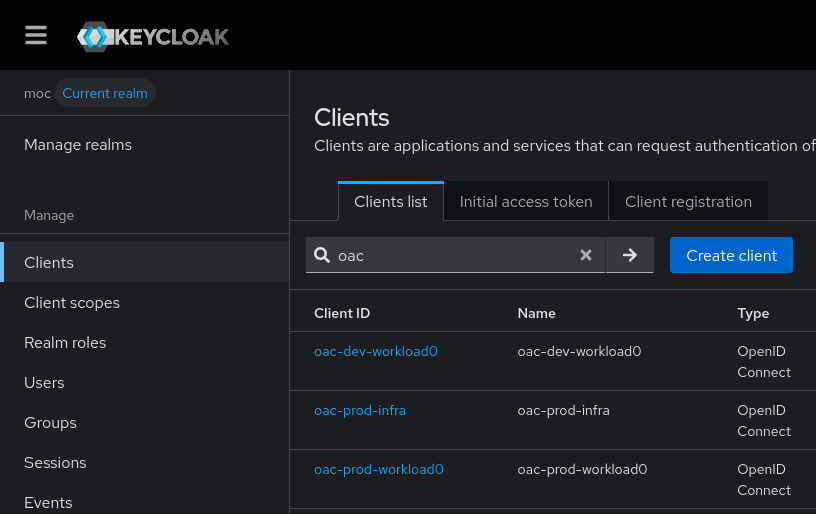
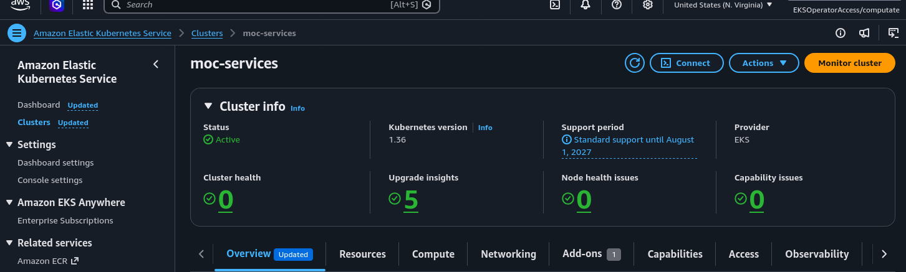
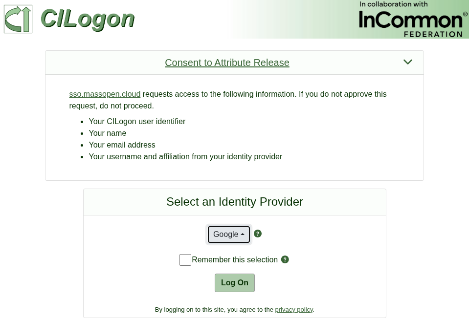

# moc-keycloak

## Introduction to Keycloak running at sso.massopen.cloud



The Keycloak service running at sso.massopen.cloud
is a production facing Keycloak for authentication and authorization
of MOC public facing services.
There is one Keycloak Realm `moc` defined for all MOC services.
Users of MOC services include the MOC Ops team, Red Hat Open Accelerator team, and customers of MOC cloud services.
Users are authenticated through CILogon as the primary identity provider of the `moc` Realm.

## MOC EKS cluster on AWS



The MOC Keycloak service is deployed on an Elastic Kubernetes Service deployed on Amazon Web Services.
This Kubernetes cluster was installed to provide public access to highly available Keycloak and Coldfront services for the MOC.
The [configuration for the moc-services EKS cluster was made in this pull request](https://github.com/CCI-MOC/moc-aws/pull/18/changes).

## Postgres database deployment to EKS

Before deploying Keycloak to the moc-services Kubernetes cluster,
a PostgreSQL database is required.
The [Crunchy Postgres Operator](https://github.com/CCI-MOC/moc-services-config/blob/main/cluster-scope/bundles/crunchy-postgres-operator/kustomization.yaml) was installed with Kustomize GitOps to the moc-services Kubernetes cluster.
A [PostgresCluster](https://github.com/CCI-MOC/moc-services-config/blob/main/postgres/base/postgresclusters/postgrescluster.yaml) resource was created with Kustomize GitOps to store the Keycloak and Coldfront databases.

## Keycloak deployment to EKS

With a database in place for Keycloak, the [Keycloak Operator](https://github.com/CCI-MOC/moc-services-config/blob/main/cluster-scope/bundles/keycloak-operator/kustomization.yaml) was installed with Kustomize GitOps to the moc-services Kubernetes cluster.
A [Keycloak](https://github.com/CCI-MOC/moc-services-config/blob/main/keycloak/base/keycloaks/keycloak/keycloak.yaml) resource was created with Kustomize GitOps to integrate Keycloak with the database, and make Keycloak publicly available at [sso.massopen.cloud](https://sso.massopen.cloud).

## SMTP and CILogon credentials

New users that access MOC services will be required to logon through CILogon, validate their email address, and accept a EULA before being granted access.
The MOC has SMTP credentials configured in AWS Secrets Manager.
To provide Keycloak with these credentials, [OpenTofu SMTP credentials configuration](https://github.com/CCI-MOC/moc-keycloak/blob/main/data.tf) were configured.

## Realm moc OpenTofu configuration

MOC services are all provided by one Keycloak Realm called `moc`.
Here is the [OpenTofu configuration of the moc Realm](https://github.com/CCI-MOC/moc-keycloak/blob/main/realm_moc.tf),
which loads the SMTP credentials from AWS Secrets Manager,
and configures the MOC specific `moc_localization` `terms.html`.

## CILogon Identity Provider



All users authenticate by default to CILogon.
Here is the [OpenTofu configuration of the CILogon Identity Provider](https://github.com/CCI-MOC/moc-keycloak/blob/main/idp_cilogon.tf) in the `moc` realm that also references the `cilogon_credentials` from AWS Secrets Manager.

## OpenShift clusters as individual Keycloak Clients

The MOC maintains several OpenShift clusters,
and authentication to each cluster console goes through Keycloak.
An OpenTofu object containing specific details of each OpenShift cluster is found in
[OpenTofu configuration of OpenShift Clusters](https://github.com/CCI-MOC/moc-keycloak/blob/main/main.tf).
Each cluster specifies a `cluster_name`, `openshift_redirect_uri`, `client_secret_name`, and `keycloak_client_uuid`.
This is enough detail about each cluster to configure a Keycloak Client for each OpenShift cluster and push the Client Secret to AWS Secrets Manager for the OpenShift Cluster OpenTofu deployment to access.

An [OpenTofu module named openshift_oidc](https://github.com/CCI-MOC/moc-keycloak/blob/main/modules/openshift-oidc/main.tf) is run for each OpenShift cluster.
This configures the Keycloak Client with the expected OpenShift Cluster settings for OpenID Connect.

## MOC specific Auth flows

The MOC has a customized login workflow, based on CILogon that provides the right experience for a user to accept terms of the MOC, validate their email, and log in through CILogon and then into the OpenShift clusters or other MOC services they came to access.

- This is the [customized browser auth flow](https://github.com/CCI-MOC/moc-keycloak/blob/main/authentication_flow_browser.tf) that redirects users to the CILogon Identity Provider.
- This is the [require existing user auth flow](https://github.com/CCI-MOC/moc-keycloak/blob/main/auth_flow_require_exist_user.tf) that expects the current Open Accelerator users to be preregistered, and auto links their email to their CILogon account on the first logon.
- This is the [CILogon first broker auth flow](https://github.com/CCI-MOC/moc-keycloak/blob/main/auth_flow_cilogon_first_broker.tf) that
  - `review_profile` `DISABLED`: disables reviewing their user profile
  - `confirm_link` `DISABLED`: disables confirm link existing account
  - `email_verification` `REQUIRED`: requires the user to verify email address
  - `verify_existing_account_by_reauthentication` `DISABLED`: disables verify existing account by re-authentication

## OpenShift Groups in Keycloak

MOC OpenShift Clusters have groups of users, like `open-accelerator-admins`, `coldfront-admins`, `pi`, and other projects that need to access resources on the OpenShift cluster.
These Groups are managed by Keycloak, and OpenShift knows the group of each user that logs in through Keycloak by the groups claim.
An OpenTofu list of these groups is found in
[OpenTofu user group configuration](https://github.com/CCI-MOC/moc-keycloak/blob/main/groups.tf).


## Testing things locally

1. Spin up a local keycloak instance:

    ```
    make setup
    ```

    It will take a few seconds for keycloak to become healthy.

2. Run `make init-local`. This will:

    - override the S3 backend with a file backend
    - rename `imports.tf` to `imports.tf.disabled`
    - create `local-test.auto.tfvars` to point opentofu at the local keycloak instance

3. Run `tofu plan` or `tofu apply`, etc.

4. When you're done, run `make init-remote`. This will undo the changes introduced by `make init-local`.

5. To tear down your local Keycloak instance:

    ```
    make teardown
    ```

    This will stop the containers, destroy the postgres backing store, and erase your local `terraform.tfstate*` files.

Note that if you are applying this configuration against a fresh keycloak instance, you will need to run the following steps to bootstrap the environment:

```
tofu apply -var first_broker_login_flow='first broker login' -target keycloak_realm.moc
tofu apply -var first_broker_login_flow='first broker login'
tofu apply
```

## CI apply via GitHub Actions OIDC

The apply workflow (`.github/workflows/apply.yaml`) applies this
configuration on pushes to `main`. It authenticates to Keycloak using GitHub
Actions' OIDC identity (using [federated client authentication]).

[federated client authentication]: https://www.keycloak.org/2026/01/federated-client-authentication
